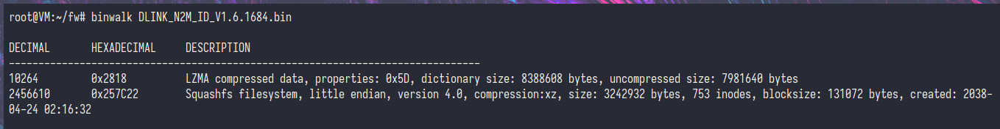
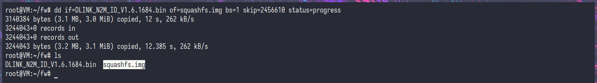
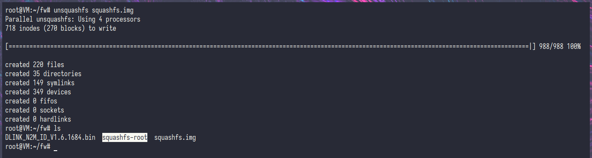
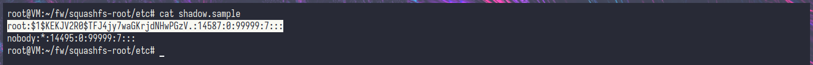
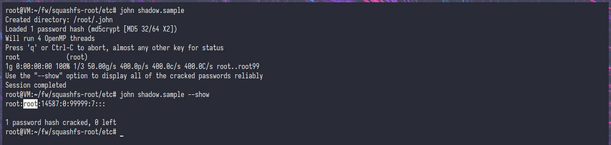
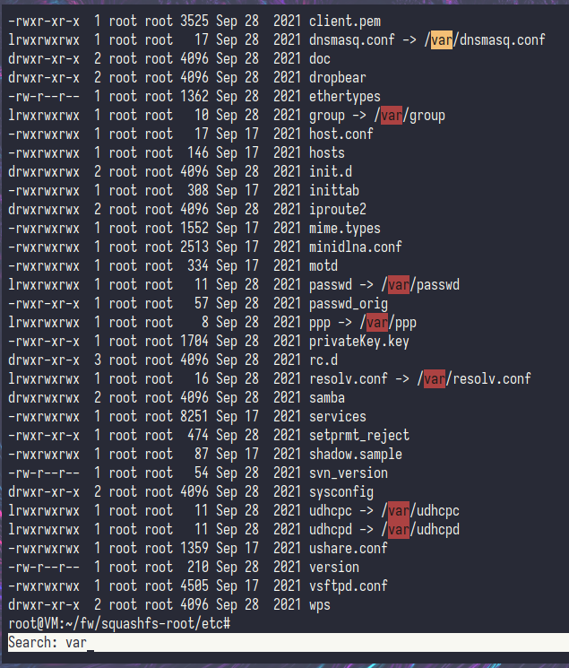
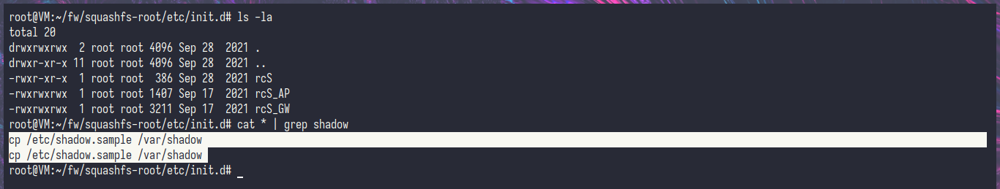

# D-Link DIR-1253 Hardcode Vuln.

### Product Information
```
Manufacture Link: http://www.dlinktw.com.tw
Product Name	: P/N: IIR1253EID...A1E (aka. DLINK_DIR-1253)
Product Version	: H/W Ver.:A1
		: F/W Ver.:V1.6.1303 (Before Update)
Firmware Version: V1.6.1684 (Lastest)
Firmware Link	: https://github.com/twentysevns/DIR-1253/releases/download/release/DLINK_N2M_ID_V1.6.1684.bin
Notes		: This report are created from my own property, and Firmware are not release in anywhere so i ask the Vendor to got last update for my DIR-1253.
Writer		: twentysevns@proton.me
```
### How to
1. Analyzing with ```binwalk``` and got rootfs decimal address "2456610".


2. Extract with ```dd``` named with ```squash.img```.


3. After that extract with ```unsquash``` the result are ```squashfs-root``` directory.


4. Go to ```./squashfs-root/etc``` here you can see the root password in ```shadow.sample```


5. Crack it with ```john``` the password are same as user ```root``` 


6. All services linked to ```/var``` directory, so that mean nothing yup?


7. Here you can see in ```./etc/init.d/``` directory, which mean that directory are will executed on boot that script containing about copying ```shadow.sample``` to ```/var/shadow``` so the password that has been crack before are in use, and ```/var``` are mainly environment after bootup.


### Result
```
User: root
Pass: root
```
